# 8DO-TOURISM(8도관광)
2024년 상반기 오르미 4기 파이널 프로젝트 _ 8조

- 스프링 부트 _ 8도관광(고속버스 예매 사이트)
- [배포 URL](http://43.202.23.27:8080)

## 🗒️ 0. 목차
1. [프로젝트 소개](#1-프로젝트-소개)
2. [개발 기간](#2-개발-기간)
3. [멤버 구성](#3-멤버-구성)
4. [개발 환경](#4-개발-환경)
5. [프로젝트 구조](#5-프로젝트-구조)
6. [프로젝트 아키텍처](#6-프로젝트-아키텍처)
7. [UI 설계](#7-ui-설계)
8. [ERD 설계](#8-erd-설계)
9. [API 명세](#9-api-명세)
10. [기능 명세](#10-기능-명세)
11. [시연 영상](#11-시연-영상)
12. [프로젝트 회고](#12-프로젝트-회고)

## 🖥️ 1. 프로젝트 소개
이 프로젝트는 Spring 기반의 고속버스 예매 웹 애플리케이션입니다. <br>
[국토교통부(TAGO) API](https://www.data.go.kr/data/15098522/openapi.do?recommendDataYn=Y) 를 활용해 고속버스의 노선 조회 및 예매를 할 수 있습니다. <br>
또한, ESTsoft에서 제공하는 Alan AI를 통해 목적지를 추천받을 수 있습니다.
<br>
<div align="right">

[목차](#0-목차)
</div>

## 🕰️ 2. 개발 기간

* 프로젝트 일정: 04/24(수) ~ 05/16(목)
* 프로젝트 발표: 05/17(금)

<div align="right">

[목차](#0-목차)

</div>

## 🧑‍🤝‍🧑 3. 멤버 구성
- 김용준 (팀장) : 예약 관련 API 개발, 결제 API 개발
- 강한주 (팀원) : 버스 외부 APi 개발, 버스 예약 관련, 찜 API 개발
- 김정용 (팀원) : SMTP EMAIL API 개발, Alan AI 적용, 와이어프레임
- 박지수 (팀원) : 와이어프레임, 문의 게시판, 질문 게시판 API 개발
- 안태규 (팀원) : User API 개발, 배포 및 CI/CD 파이프라인 구축

<div align="right">

[목차](#0-목차)

</div>

## ⚙️ 4. 개발 환경
- **Java** : 
- **IDE** : 
- **Framework** : 
- **Database** :  , 
- **Server** : 
- **WS/WAS** : 
- **Meeting** : , 
- **Front-end** : , , ,  
- **CI/CD** :  , , 

<div align="right">

[목차](#0-목차)

</div>

## 🔨 5. 프로젝트 구조

```
├─main
│  ├─java
│  │  └─com
│  │      └─estsoft
│  │          └─paldotourism
│  │              ├─config      # 애플리케이션 설정 파일
│  │              ├─controller  # 컨트롤러 클래스
│  │              ├─dto         # 데이터전송객체
│  │              ├─entity      # 엔티티
│  │              ├─exception   # 예외처리관련
│  │              ├─repository  # 레포지토리
│  │              └─service     # 서비스 클래스
│  └─resources
│      ├─static    # 정적 파일
│      │  ├─css    
│      │  ├─img    
│      │  └─js     
│      └─templates # HTML + Thymleaf 파일

```
<div align="right">

[목차](#0-목차)

</div>

## 📔 6. 프로젝트 아키텍처
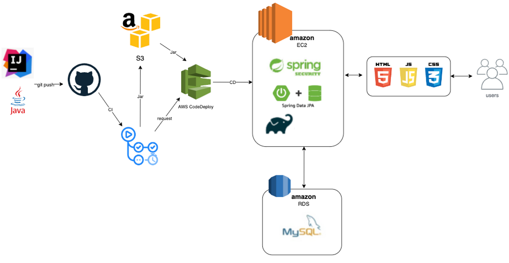

<div align="right">

[목차](#0-목차)

</div>

## 📺 7. UI 설계
[figma_link](https://www.figma.com/file/U5E9NIldaSkr28AP0Eebyp/8%EB%8F%84%EA%B4%80%EA%B4%91-%ED%99%94%EB%A9%B4%EC%84%A4%EA%B3%84?type=design&node-id=2-3&mode=design&t=JHOtFtCp44wTFtkn-0)

|||
|-|-|
|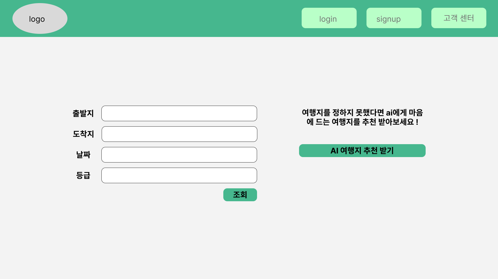메인 화면|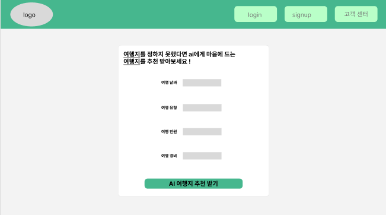AI 추천 화면|
|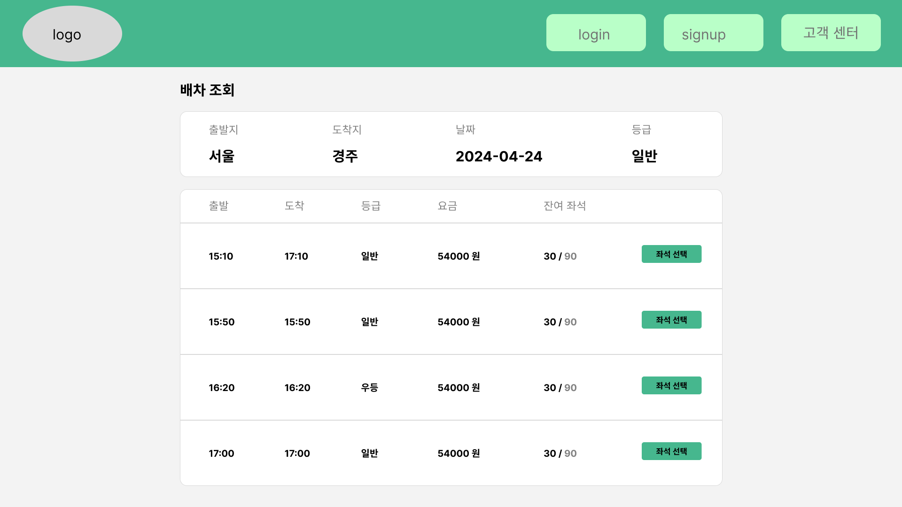버스 시간표 화면|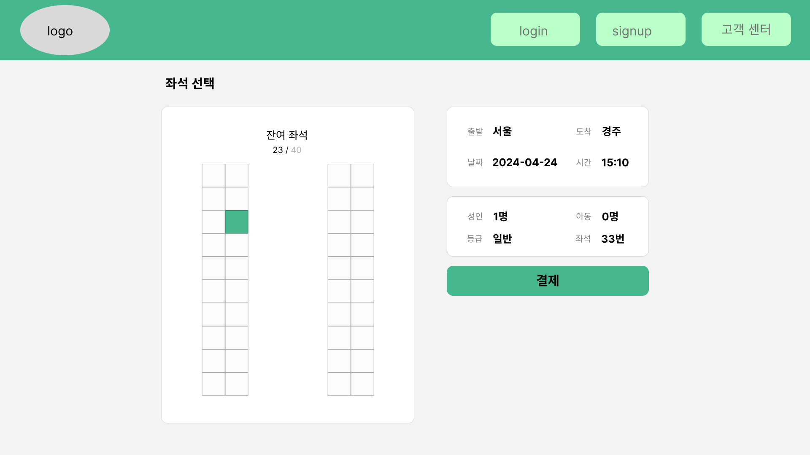좌석 선택 화면|
|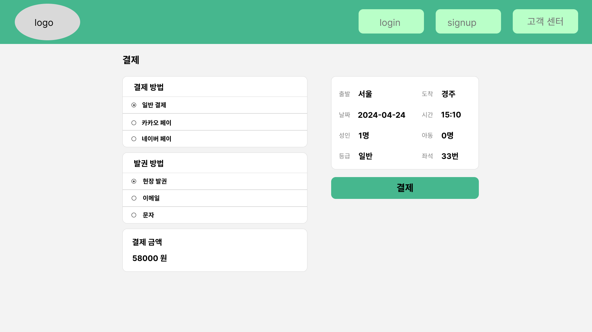결제 화면|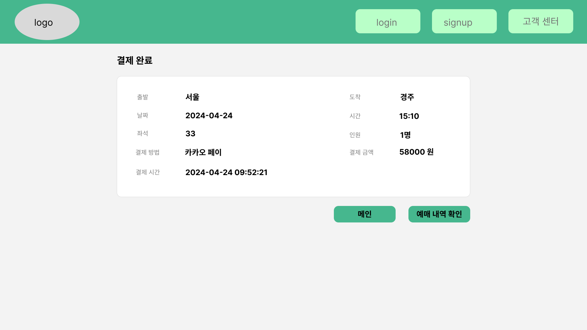결제 완료 화면|
|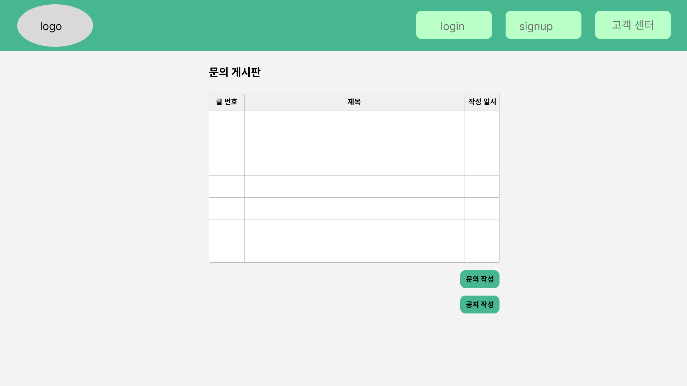QnA 메인 화면|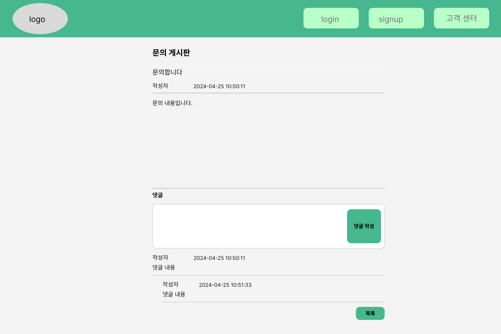QnA-read 화면|
|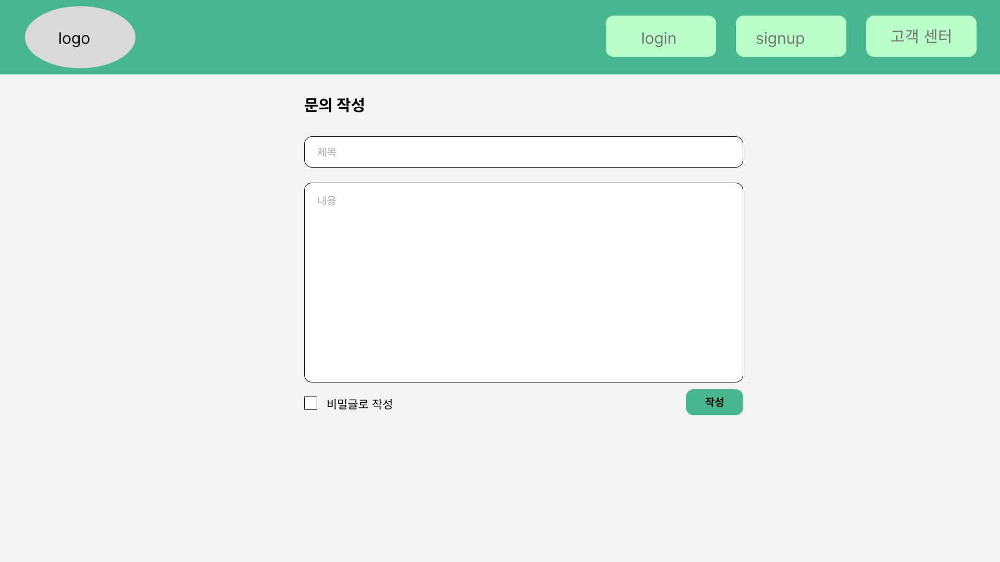QnA-write 화면|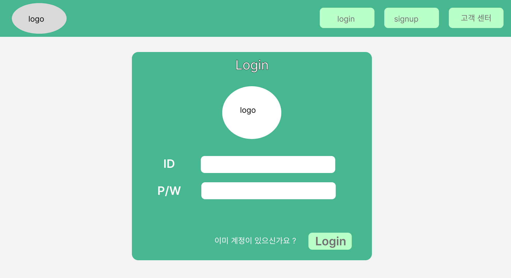로그인 화면|
|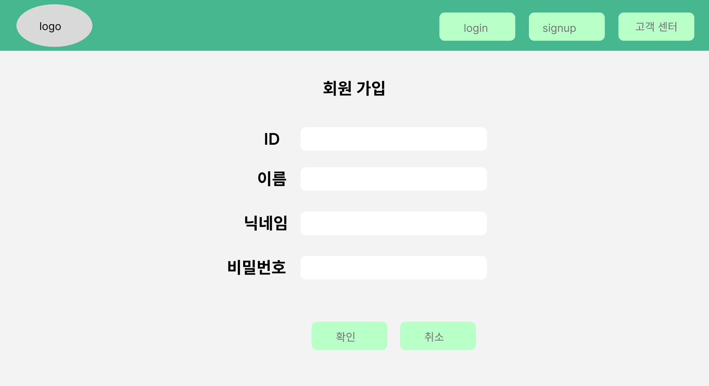회원가입 화면|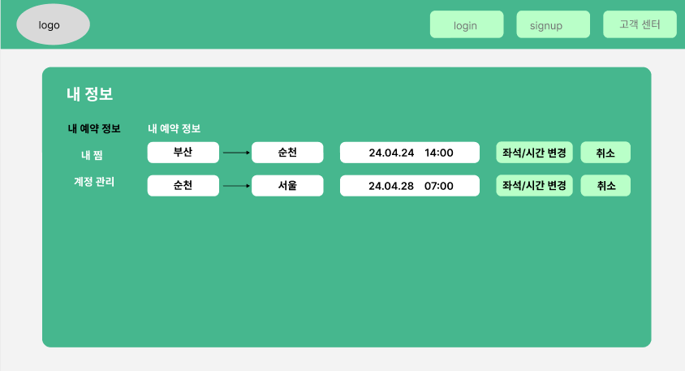내 예매 정보 화면|
|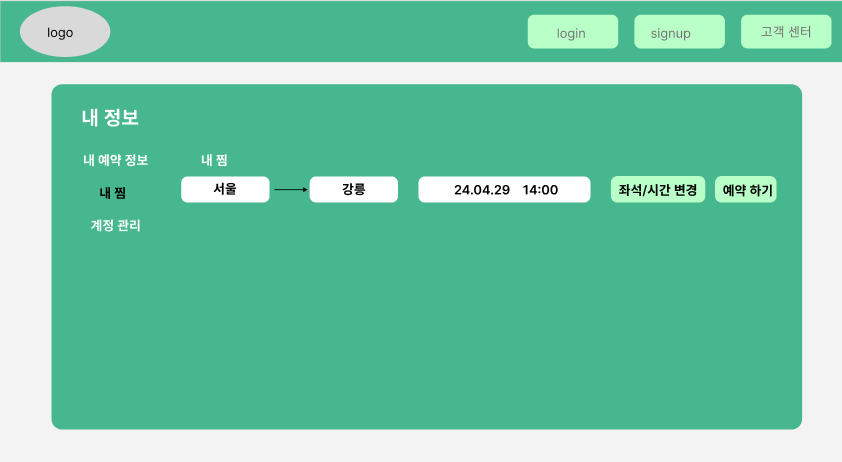내 노선 찜 화면|

<div align="right">

[목차](#0-목차)

</div>

## 💾 8. ERD 설계
[ERD CLOUD](https://www.erdcloud.com/d/TYp6nBDBZw94StuBx)
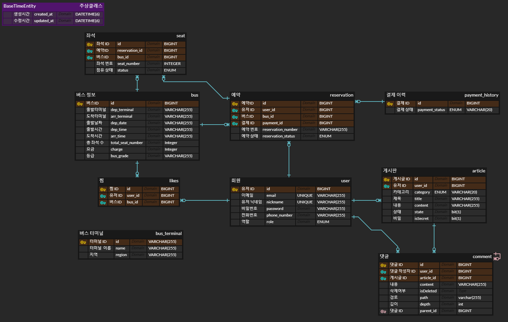

<div align="right">

[목차](#0-목차)

</div>

## 📌 9. API 명세
[API 명세](https://www.notion.so/oreumi/API-a1974fbdbf0d483da73a951721499469)

| 분류 | 기능  | METHOD | API PATH |
| --- | --- | --- | --- |
| Comment |  |  |  |
|  | 댓글 수정 | PUT | /comment/{commentId} |
|  | 댓글 삭제 | DELETE | /comment/{commentId} |
|  | 댓글 작성 | POST | /comment/write |
| Reservation |  |  |  |
|  | 예매 변경 | PUT | /api/reservation/change/{reservationId}/{busId} |
|  | 예매 취소 | PUT | /api/reservation/cancel/{reservationId} |
|  | 예매 | POST | /api/reservation/{busId} |
|  | 예매에서 총 좌석 수 조회 | GET | /api/totalSeat/{reservationId} |
|  | 예매의 총 운임 조회 | GET | /api/totalCharge/{reservationId} |
|  | 해당 좌석의 예매ID 조회 | GET | /api/seat/reservation/{reservationId} |
|  | 버스의 좌석 중복 조회 | GET | /api/seat/checkDuplicate/{busId}/{seatNumber} |
|  | 버스의 좌석 조회 | GET | /api/seat/bus/{busId} |
|  | 현재 사용자의 예매 조회 | GET | /api/reservations/currentUser |
|  | 예매 조회 | GET | /api/reservation/{reservationId} |
| Message |  |  |  |
|  | 예매 확인용 메일 전송 | POST | /send-one/{reservationId} |
| User |  |  |  |
|  | 회원가입 | POST | /api/signup |
|  | 비밀번호 찾기 | POST | /api/forgot-pw |
|  | 회원탈퇴 | POST | /api/delete-account |
|  | 비밀번호 변경 | POST | /api/change-pw |
|  | 닉네임 확인 | GET | /api/check-nickname |
|  | 이메일 확인 | GET | /api/check-email |
| Like |  |  |  |
|  | 찜 등록 | POST | /api/likes |
|  | 찜 삭제 | DELETE | /api/likes |
| Bus |  |  |  |
|  | 지역으로 터미널 조회 | GET | /api/terminals |
|  | 이름으로 터미널 조회| GET | /api/search |

<div align="right">

[목차](#0-목차)

</div>

## 📌 10. 기능 명세
| No | 분류  | 기능 | 기능 설명 | 
| --- | --- | --- | --- | 
| 메인페이지 |  |  |  |  |
| 1 | 노선 조회 | 노선 조회 | 사용자가 출발 터미널/도착 터미널/가는 날/인원/등급을 폼에 입력하고 ‘조회’버튼을 누를시에 해당하는 버스 리스트 조회 가능(다음페이지로 이동) | 
| 2 | AI 여행지 추천 받기  | AI 여행지 추천 받기  | AI 여행지 추천 받는 페이지로 이동   | 
| 예약 |  |  |  |  |
| 1 | 노선 검색 | 노선 정보 검색 | 원하는 조건을 선택한 후 검색을 누르면 해당 조건에 맞는 노선 정보들을 보여줌  |
| 2 | 노선 예약 | 노선 예약 | 원하는 노선을 선택하고 누르면 좌석 선택 화면으로 이동  |
| 3 | 좌석 선택 | 원하는 좌석 선택해서 좌석 예약 | 현재 예약 가능한 좌석들 중 원하는 좌석을 선택할 수 있음  |
| 게시판 |  |  |  |  |
| 1 | 목록 | 일반 목록 | 조건 없이 문의 목록을 조회 |
|  |  | 검색 목록 | 검색 조건을 설정하여 문의 목록을 조회 |
| 2 | 조회 | 내용 조회 | 제목, 작성자, 작성일, 내용 조회. 회원 및 관리자만 읽기 가능. |
|  |  | 댓글 조회 | 댓글 제목, 작성자, 작성일, 내용 조회. 회원 및 관리자만 읽기 가능. |
| 3 | 작성 | 문의 작성 | 회원인 경우 문의 제목 및 내용 작성. |
|  |  | 공지 작성 | 관리자인 경우 공지 제목 및 내용 작성. |
| 4 | 수정 | 문의 수정 | 문의 제목 및 내용 수정. 작성자만 수정 가능. |
|  |  | 공지 수정 | 공지 제목 및 내용 수정. 관리자만 수정 가능. |
| 5 | 삭제 | 문의 삭제 | 작성자 및 관리자만 삭제 가능. |
|  |  | 공지 삭제 | 관리자만 삭제 가능. |
| 6 | 댓글 작성 | 문의 댓글 작성 | 문의 댓글 작성. 회원 및 관리자만 작성 가능. |
| 7 | 댓글 수정 | 문의 댓글 수정 | 문의 댓글 수정. 회원 및 관리자만 수정 가능. |
| 8 | 댓글 삭제 | 문의 댓글 삭제 | 문의 댓글 삭제. 회원 및 관리자만 삭제 가능. |
| AI(Alan) |  |  |  |  
| 1 |  | AI 여행지 추천 받기  | 사용자가 폼에 날짜/여행 유형(?)/여행 인원/여행 경비를 입력하면 그 결과를 바탕으로 AI가 여행지 한 곳을 추천해 줍니다.  | 
| 회원관리 |  |   |  |  
| 1 | 회원가입 | 회원 가입(기본) | 닉네임, 비밀번호, Email, 휴대폰 번호를 통한 회원가입 기능 |
|  |  | 중복 확인 | 회원 가입시 해당 Email로 이미 가입이 되어있는지, 닉네임이 이미 존재하는지 확인 |  
| 2 | 로그인 | 로그인(기본) | Email, 비밀번호를 통한 로그인 기능 |
| 3 | 비밀번호 관련 | 비밀번호 찾기 | 현재 로그인 상태 확인 후에 비밀번호 찾기 |  
|  |  | 비밀번호 변경 | 현재 로그인 상태 확인 후에 비밀번호 변경 |  
| 4 | 회원 탈퇴 | 회원 탈퇴(기본) | 회원 탈퇴 기능 |  
| 5 | 내 예약 정보  | 사용자가 예약한 버스 리스트 조회 | 사용자가 예약한 버스들 정보를 보여준다. 출발지와 목적지,출발 시간이 적혀 있으며 옆에 좌석/시간 변경, 취소를 눌러 해당 기능 실행 가능 |  
| 6 | 내 찜  | 사용자가 찜한 버스 리스트 조회 | 사용자가 찜한 버스들 정보를 보여준다. 출발지와 목적지, 출발 시간이 적혀 있으며 찜 취소가 가능하며 예약 하기 버튼을 누르면 예약 페이지로 이동  | 

<div align="right">

[목차](#0-목차)

</div>

## 📽️ 11. 시연 영상

<div align="right">

[목차](#0-목차)

</div>

## 📜 12. 프로젝트 회고

### 👨‍💻 김용준
가나다라마바사
### 👩‍💻 강한주
가나다라마바사
### 👨‍💻 김정용
가나다라마바사
### 👨‍💻 박지수
가나다라마바사
### 👨‍💻 안태규
가나다라마바사

<div align="right">

[목차](#0-목차)

</div>
